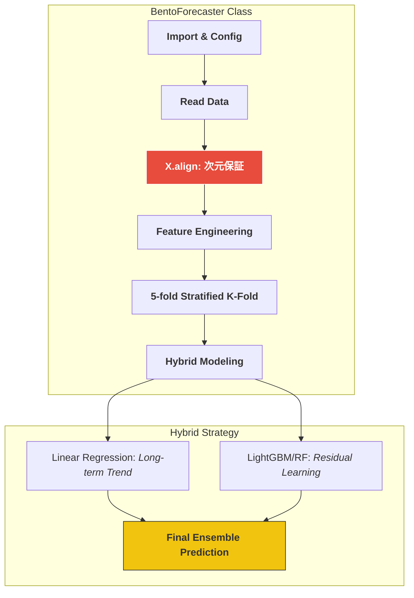

# 🍱 SIGNATE Bento Demand Forecasting (Master Model Implementation)

お弁当の需要予測において、単なるスコアアップではなく、**「実務に耐えうる堅牢な機械学習パイプライン」**と**「保守性の高いクラス設計」**を追求したプロジェクトです。

---

## 📊 処理フロー：黄金のフローによるカプセル化



---

## 🛠️ 実装のこだわり (Master型設計)

### 1. 聖域の1行：`X.align` による次元保証
- **Why**: 実務で最も恐ろしい「訓練時と推論時の特徴量ズレ」を未然に防ぎ、モデルの堅牢性を絶対的なものにするためです。

### 2. ハイブリッド予測戦略
- **Action**: 線形モデルで長期トレンドを、木モデルで「お楽しみメニュー」等の非線形要素を学習。
- **Why**: 弁当需要のような季節性と突発イベントが混在するデータに対し、単一モデルよりも解釈性と精度のバランスに優れた予測を可能にします。

---

## 📂 プロジェクト構造 (Directory Structure)

```text
.
├── .github/workflows/ # GitHub Actions (Python CI)
├── src/               # 予測モデル実装 (BentoForecasterクラス)
├── data/              # 訓練・テストデータ
└── requirements.txt   # 依存ライブラリ
```

---

## 🎖️ About Me

**Kou Sato (Moheji)**
データエンジニア / データサイエンティスト
「技術をビジネスの価値に変換する」をモットーに、IaCからMLモデル構築まで一貫したデリバリーを追求しています。
```