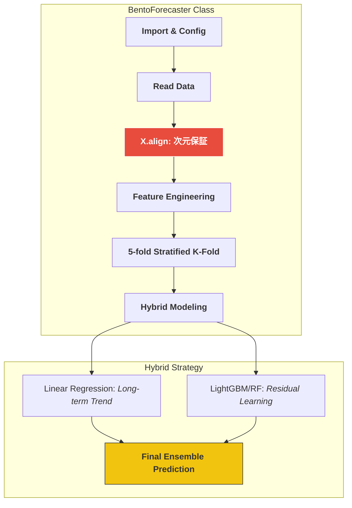

```markdown


# 🍱 SIGNATE Bento Demand Forecasting (Master Model Implementation)

お弁当の需要予測において、単なるスコアアップではなく、**「実務に耐えうる堅牢な機械学習パイプライン」**と**「保守性の高いクラス設計」**を追求したプロジェクトです。

---

## 📊 処理フロー：黄金のフローによるカプセル化



---

## 🛠️ 実装のこだわり (Master型設計)

### 1. 聖域の1行：`X.align` による次元保証
- **Why**: 実務で最も恐ろしい「訓練時と推論時の特徴量ズレ（Data Drift/Schema Mismatch）」を未然に防ぎ、モデルの堅牢性を絶対的なものにするためです。

### 2. ハイブリッド予測戦略
- **Action**: 線形モデルで長期トレンドを、木モデルで「お楽しみメニュー」等の非線形要素（残差）を学習。
- **Why**: 弁当需要のような季節性と突発イベントが混在するデータに対し、単一モデルよりも解釈性と精度のバランスに優れた予測を可能にします。

---

## 📂 プロジェクト構造 (Directory Structure)
（既存の内容を継承）
```

---

### 🚀 次のアクション：Python CI の導入

このリポジトリには、Pythonのコード品質を保つための Actions を追加しましょう。

1.  `.github/workflows/python-ci.yml` を作成。
2.  以下のコードを貼り付け。

```yaml
name: 'Python CI'

on:
  push:
    branches: [ "main" ]

jobs:
  lint:
    runs-on: ubuntu-latest
    steps:
    - uses: actions/checkout@v4
    - name: Set up Python
      uses: actions/setup-python@v5
      with:
        python-version: '3.10'
    - name: Install dependencies
      run: pip install flake8
    - name: Lint with flake8
      run: flake8 src/ --count --select=E9,F63,F7,F82 --show-source --statistics
```