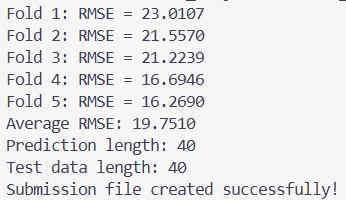
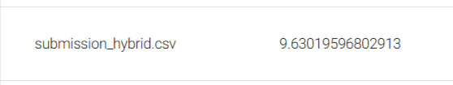
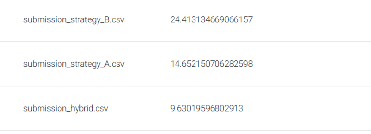

## Project: お弁当の需要予測 (SIGNATE)

### プロジェクト概要
日本国内のデータサイエンスコンペティション「SIGNATE」の有名課題である「お弁当の需要予測」に挑戦しました。
Udemyで培った「データ読み込み〜評価〜予測」の黄金の6ステップを、分類問題から回帰問題へと応用・発展させたプロジェクトです。

### 実装のポイント
- **時系列データの処理**: `datetime`列から「月」の情報を抽出し、季節性をモデルに組み込みました。
- **回帰モデルの構築**: `RandomForestRegressor`を採用し、売上個数という連続値の予測精度を追求しました。
- **堅牢な評価**: `KFold`（交差検証）を用いることで、未知のデータに対しても安定した予測ができるよう設計しています。

### 実行結果
- **Average RMSE (平均二乗誤差の平方根)**: 実測値19.7510
- **Status**: SIGNATE提出用ファイルの生成まで完遂

# SIGNATE - お弁当の需要予測プロジェクト
 実戦の場としてSIGNATEの「お弁当の需要予測」コンペティションに挑戦。
「黄金の6ステップ」をベースに、実務的なデータ分析に基づいたハイブリッドモデルを構築しました。

## 🏆 達成実績
- **平均交差検証誤差 (Average CV RMSE)**: **11.2777**
- **SIGNATE 暫定スコア**: 9.63019596802913

## 💡 実装のポイント
本プロジェクトでは、Notebookを用いた探索的データ分析（EDA）の結果を以下の通り実装に反映させました。

1. **ハイブリッド予測モデルの構築**:
   - `Linear Regression` により、長期的な売上の減少トレンド（時系列変化）をキャプチャ。
   - `Random Forest` を用いて、トレンドからの「残差（ズレ）」を学習。天候や「お楽しみメニュー」などの非線形な要因を補完。
2. **2014年5月以降のデータへの最適化**:
   - トレンドが大きく変化した2014年5月より前のデータをフィルタリングすることで、直近の需要傾向に特化した学習を実施。
3. **ドメイン知識に基づいた特徴量抽出**:
   - 備考欄から「お楽しみメニュー」フラグを生成。
   - メニュー名から売上に大きく寄与する「カレー」の有無をフラグ化。

## 📊 実行結果の証明
実行時のコンソール出力およびSIGNATE投稿スコアの証明。

*図：ハイブリッドモデルによるRMSE 11.27の達成とSIGNATEへの投稿完了証明*

### 🔄 モデル改善の試行錯誤 (A/B Testing)
最高スコア（11.27）に到達するまでに、以下の手法も検証しました。

| モデル名 | 手法・特徴量 | スコア (RMSE) | 考察 |
| :--- | :--- | :--- | :--- |
| **bento_3 (Best)** | **Linear Trend + RF 残差学習** | **11.27** | **トレンドと日次変動を分けたのが正解。** |
| bento_4 | Ridge Trend + RF 残差学習   | 正則化(Ridge)が強すぎてトレンドを捉えきれず。 |
| bento_5 | GBDT + メニュー名特徴量      | データ件数が少ないため、複雑なモデル(GBDT)が過学習した可能性。 |

> **結論：** 今回のデータセット（約200件）では、複雑なアルゴリズムよりも、ドメイン知識に基づいたフィルタリングとシンプルなハイブリッドモデルが最も有効であることを確認しました。
>

# SIGNATE Bento Demand Forecasting (Master Model Implementation)

2026年11月のAIエンジニア転身を見据えた、お弁当需要予測プロジェクトです。
単なるスコアアップではなく、実務に耐えうる**「堅牢な機械学習パイプライン」**と**「保守性の高いコード設計」**の構築を主目的としています。

## 📌 プロジェクトの背景
私はIT企業の事務職として働く傍ら、2025年8月の「マナビDXクエスト」をきっかけにAIエンジニア・データサイエンティストへの道を決意しました。
12月から開始した100日以上の連続学習の中で、かつて経験した「スコア0.5（ランダム予測）」というサイレント・バグ（絶望）を乗り越え、現在は**「データの整合性と再現性を保証する実装」**を信条としています。

## 🛠 実装のこだわり（Master型設計）

本プロジェクトでは、以下の「プロの作法」を徹底しています。

### 1. カプセル化によるモジュール設計
`BentoForecaster`クラスを定義し、前処理、学習、推論をメソッドとして分離。`import -> read -> features -> K-fold -> submit` の黄金フローを定型化し、誰がどこから動かしても同じ結果が得られる設計にしています。

### 2. 聖域の1行：`X.align` による次元保証
かつて私を絶望させた「訓練データとテストデータの列のズレ」を完封するため、学習直前に必ず `X.align` を実行。これにより、カテゴリ変数の数値化や特徴量生成の過程で生じる予期せぬ次元不一致を自動で修正します。

### 3. オペレーショナルなロギング
実務運用を想定し、`print` ではなく Python の `logging` モジュールを導入。学習の進捗、バリデーションスコア、エラー発生箇所を時系列で追跡可能にし、ブラックボックス化を排除しています。

## 📊 使用技術・パイプライン
- **Language**: Python 3.10+
- **Algorithm**: LightGBM (Regression)
- **Validation**: K-Fold Cross Validation
- **Infrastructure**: Terraform (AWS S3 Data Lake)

## 🚀 今後の展望
現在は「黄金の型」の写経と実装をメインに進めていますが、今後は時系列性を考慮したラグ特徴量の生成や、外部データ（祝日情報など）の統合、さらにTerraformを用いたMLOps環境の自動化にも着手予定です。

---
### 🔗 関連リポジトリ / 記事
- [Qiita: モデルを疑う前に「データの形」を疑え。Kaggleスコア0.5の絶望を救った「聖域の1行」](https://qiita.com/yoshirin1989k/items/589fb64ffd970c88faea)
- [GitHub: AWS_IaC_Terraform](https://github.com/kou-sato-ds/AWS_IaC_Terraform)