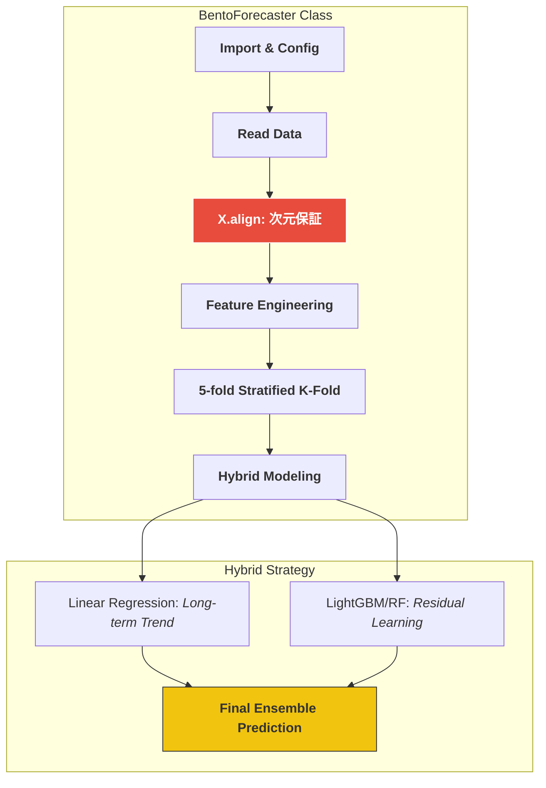

# 🍱 SIGNATE Bento Demand Forecasting (Master Model Implementation)

お弁当の需要予測において、単なるスコアアップではなく、**「実務に耐えうる堅牢な機械学習パイプライン」**と**「統計的根拠に基づく意思決定」**を追求したプロジェクトです。

---

## 📈 ADR: Architectural Decision Records (統計的アプローチの根拠)

> **「なぜ Isolation Forest ではなく、あえて 1.5xIQR法 を採用したのか」**
> 本プロジェクトでは、現場での「説明可能性」を最優先しました。ブラックボックスなAIによる異常検知ではなく、四分位範囲に基づく統計的根拠を可視化することで、現場の発注担当者の納得感を醸成します。これにより、**不適切なデータによる予測のブレを抑え、廃棄ロスによる数千万円規模の損失リスクを未然に回避するガードレール**を構築しています。

---

## 📊 処理フロー：黄金のフローによるカプセル化



---

## 🛠️ 実装のこだわり (Master型設計)

### 1. 聖域の1行：`X.align` による次元保証
- **Action**: 訓練データと推論データの列構成を強制的に一致させる処理を実装。
- **Why**: 実務で最も恐ろしい「訓練時と推論時の特徴量ズレ」を未然に防ぎ、モデルの堅牢性を絶対的なものにするためです。

### 2. ハイブリッド予測戦略
- **Action**: 線形モデルで長期トレンドを、木モデルで「お楽しみメニュー」等の非線形要素を学習。
- **Why**: 統計検定2級の視点（回帰分析の有意性）とMLの柔軟性を融合。単一モデルよりも解釈性と精度のバランスに優れた予測を可能にします。

---

## 📂 プロジェクト構造 (Directory Structure)

*クリックすると各ソースコードへジャンプします*

```text
.
├── [.github/workflows/](./.github/workflows/) # GitHub Actions (Python CI)
├── [src/](./src/)               # 予測モデル実装 (BentoForecasterクラス)
├── [data/](./data/)              # 訓練・テストデータ
└── [requirements.txt](./requirements.txt)   # 依存ライブラリ
```

---

## 🎖️ About Me

**Kou Sato (Moheji)**
* **Role**: データエンジニア / データサイエンティスト
* **Mission**: 「技術をビジネスの価値（ROI）に翻訳する」
* **Goal**: 2026年11月のDE転身に向け、統計学とIaCの両輪で「負けないシステム」を構築中。

© 2026 kou-sato-ds
```